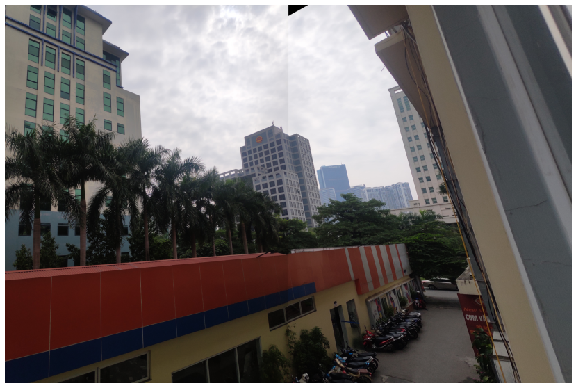

# Image Stitching with Opencv
Image stitching or photo stitching 
is the process of combining multiple photographic images with overlapping fields of view to produce a segmented panorama or high-resolution image. 

## Examples

  

